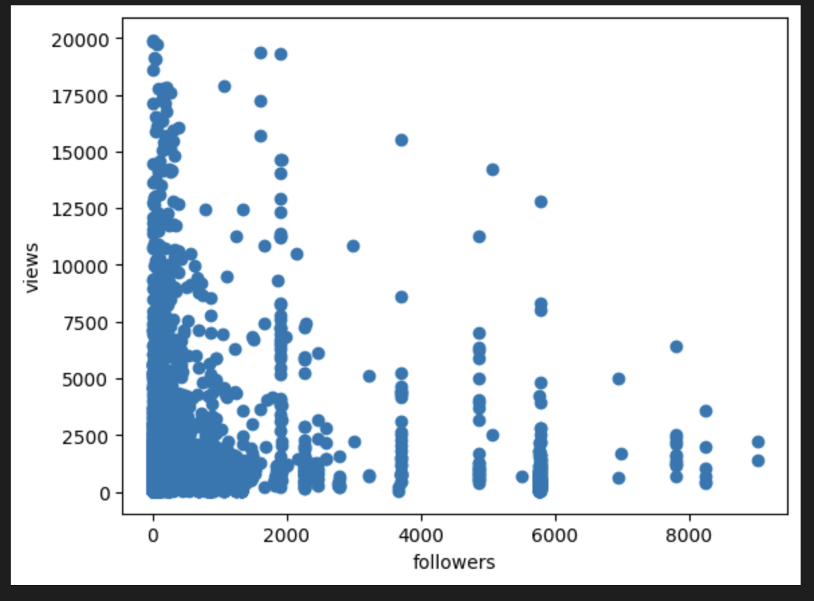
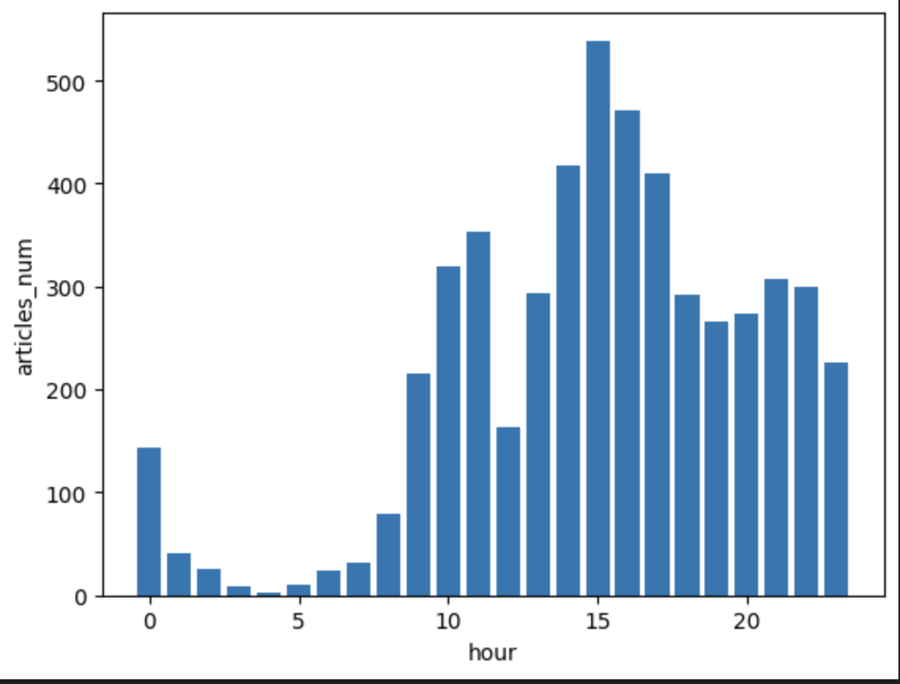
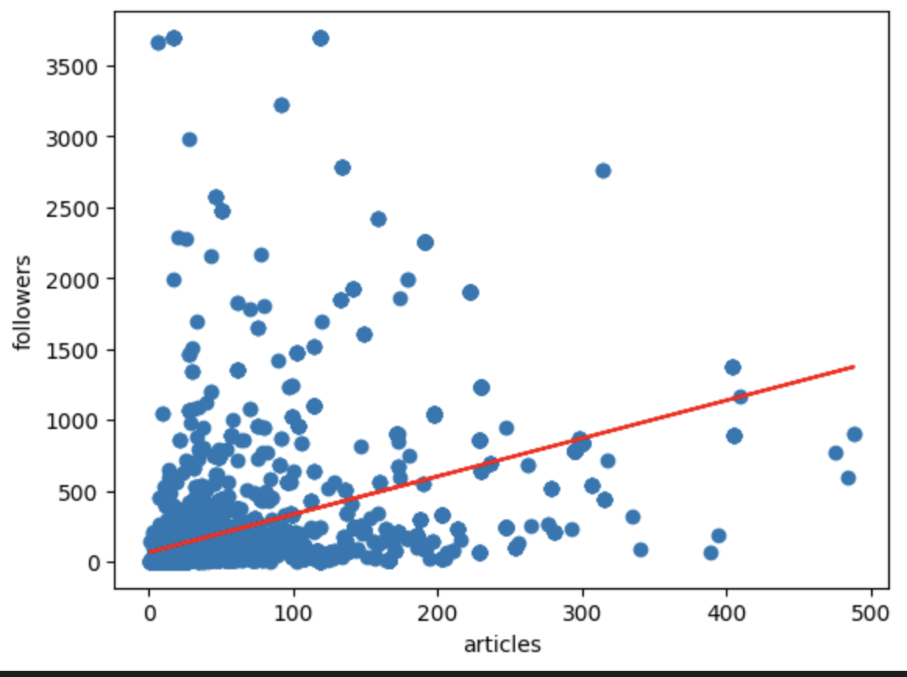
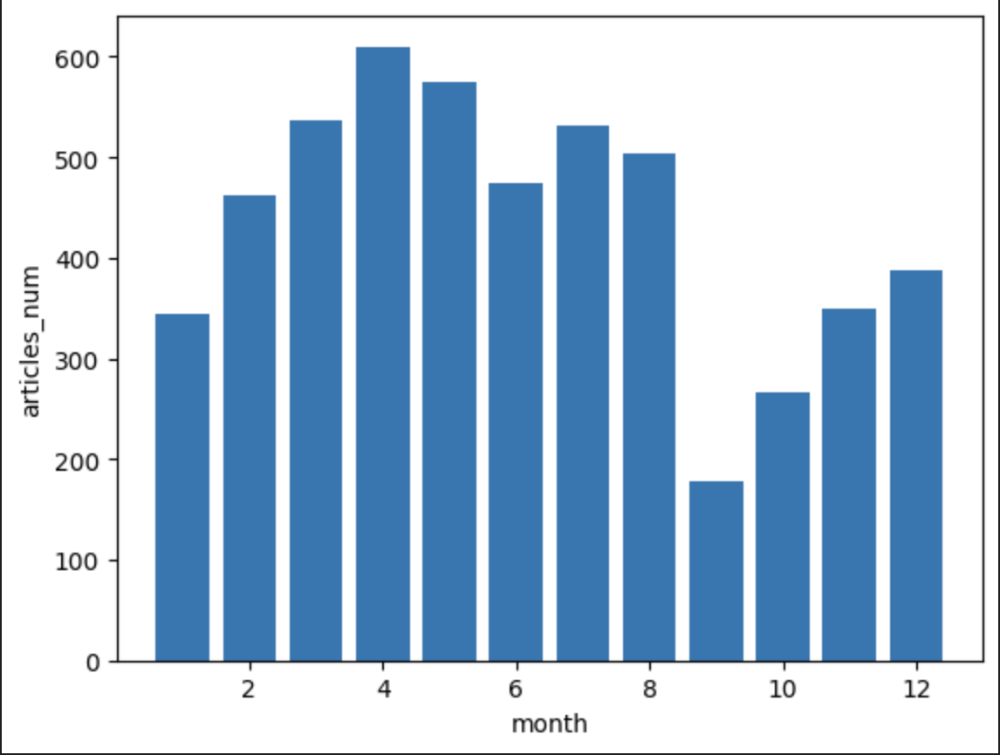
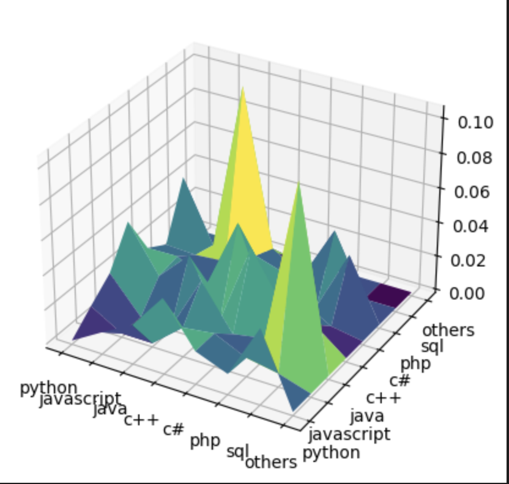

### Python爬虫数据分析

> 班级 ：计 16
>
> 姓名 ：尚子智    
>
> 学号： 2020010852

##### 有关数据来源的说明：

本次Python爬虫爬取的数据来自简书博客的专栏内容，共根据作业要求，爬取了Python，Java，C#，SQL，PHP，JavaScript，深度学习栏目的内容，从编程语言的角度来讲，数据集包括的编程语言的随机性并不是很强，针对本数据集，可以从如下的角度进行分析

#### 1. 文章阅读量与作者粉丝数的关系：

​    关于数据分析，首先想到的是每一篇文章阅读量与作者粉丝数量的关系，由于本人在调查的过程中发现，身边的同学在浏览博客网站查询信息的时候，大多没有点赞和评论的习惯，很多十万阅读量级别的文章，其点赞和评论的数量也都廖廖无几，所以认为阅读量是一篇文章受欢迎程度的直观体现，分析也从如下角度入手：

**自变量：用户粉丝数量**

**因变量：文章阅读量**

```python
import os
import json
import matplotlib.pyplot as plt
import numpy as np
dataset_dir = './dataset'
pre_dataset = os.listdir(dataset_dir)
def load_json(json_dir):
    with open(json_dir, 'r') as f:
            result_json = json.load(f)
    return result_json['results']
def get_views_followers(json_dir):
    result = load_json(json_dir)
    views = result['views']
    user_follwers = result['user_info']['粉丝']
    return (views,user_follwers)
info_list = []
for data_dir in valid_data:
    json_dir = './dataset/'+data_dir+'/result.json'
    views_followers = get_views_followers(json_dir)
    info_list += [views_followers]
def takeSecond(elem):
    return elem[0]
info_list.sort(key=takeSecond,reverse=True)
x = []
y = []
for i in range(0,5000):
    if info_list[i][0] >= 20000 or info_list[i][1] >= 10000:
        continue
    y += [info_list[i][0]]
    x += [info_list[i][1]]
x = np.array(x) # x 为粉丝数量
y = np.array(y) # y 为浏览量
plt.scatter(x, y)
plt.xlabel('followers')
plt.ylabel('views')
plt.show()
```

画出的数据图如下：



##### 在尝试添加趋势线后，发现文章阅读量与作者粉丝数之间并没有出现预期的线性正相关的关系，趋势线的斜率为副，在考虑过后，本人认为这种现象有如下的原因：

- 搜索习惯导致：根据大家平时的习惯，针对某一特定技术，往往会采用直接关键词搜索的形式进行查询，在获取有用信息后也大多不会关注作者是谁，因此文章阅读量和作者粉丝数之间的线性关系并不明显
- 国内社区生态方面：目前，从本人的直观感受来看，国内的IT博客网站的生态并不是非常好，有价值信息的来源也不十分固定，身边的同学也大多使用的是个人博客，这就导致相关方面从业者对于博客网站和博文作者的依赖性（或者说信任度）不高。

#### 2.用户活跃时间段的分析：

​		**对于用户活跃时间段，本人想要从一天二十四小时各个时间段的发帖数量来展开分析，统计所爬取博客的发布时间段，并由此绘制柱状图辅助验证**

​		**横轴：时间区间   纵轴：文章阅读量**

```python
import re
def get_time(json_dir):
    result = load_json(json_dir)
    time = result['create_time']
    res = r'([\d]*)/([\d]*)/([\d]*)\s([\d]*)'
    res = re.compile(res)
    result = re.findall(res,time)
    year = result[0][0]
    month = result[0][1]
    hour = result[0][3]
    return (year,month,hour)
info_list = []
for data_dir in valid_data:
    json_dir = './dataset/'+data_dir+'/result.json'
    followers_articles = get_time(json_dir)
    info_list += [followers_articles]
year_list = []
month_list = []
hour_list = []
for info in info_list:
    year_list += [info[0]]
    month_list += [info[1]]
    hour_list += [info[2]]
hour_set = set(hour_list)
# print(hour_set)
hour_dict = {}
for hour in hour_set:
    num = hour_list.count(hour)
    # print(num)
    new = {hour:num}
    hour_dict.update(new)
print(hour_dict)
new = []
print(int('00'))
for data in hour_dict:
    new += [(int(data),hour_dict[data])]
# print(new)
def takeFirst(elem):
    return elem[0]
new.sort(key=takeFirst)
print(new)
hour_x = []
articles_y = []
for i in new:
    hour_x += [i[0]]
    articles_y += [i[1]]
hour_x = np.array(hour_x)
articles_y = np.array(articles_y)
plt.bar(hour_x,articles_y)
plt.xlabel('hour')
plt.ylabel('articles_num')
plt.show()
```



我们可以从柱状图中得出如下结论：

- 下午3点钟是用户活跃度最高的时间，大多数用户的活跃时间在上午9-11，下午14-20这两个时间段，原因可能是这是正常的工作时间，在12点的时候迎来了一个低谷，这是正常的就餐、午休时间，在凌晨0点以后，活跃度开始降低，

#### 3. 用户粉丝数量与用户文章的关系：

​		这一点或许可以与第一点合并，但是也尝试做出调查统计，在此就不赘述了，代码如下：

```python
def followers_article(json_dir):
    result = load_json(json_dir)
    user_info = result['user_info']
    followers = user_info['粉丝']
    articles = user_info['文章']
    return (articles,followers)
info_list = []
for data_dir in valid_data:
    json_dir = './dataset/'+data_dir+'/result.json'
    followers_articles = followers_article(json_dir)
    info_list += [followers_articles]
 # 文章数量作为 x 轴， 粉丝数量作为 y 轴
articles_x = []
followers_y = []
for i in range(0,5000):
    if info_list[i][0] > 500 or info_list[i][1]>4000:
        continue
    articles_x += [info_list[i][0]]
    followers_y += [info_list[i][1]]
import pylab
plt.scatter(articles_x, followers_y)
z = np.polyfit(articles_x, followers_y, 1) 
p = np.poly1d(z) 
pylab.plot(articles_x,p(articles_x),"r") 
plt.xlabel('articles')
plt.ylabel('followers')
plt.show()
```



我们在画出的散点图中添加了趋势线，终于发现了用户的粉丝数量和发表文章间出现了期待的线性关系。针对图中有几个发表文章超过350且粉丝数量不高的，大概还是因为社区生态建设的问题，高的发表量并不能说明内容的高质量，本人在爬取的过程中也发现了很多条博客其实是广告，博客的作者也在个人主页发表了许多类似的内容，所以如上得出的结论也是可以理解的

#### 3. **一年中博客园网站的用户活跃月份分析**：

​		使用柱状图统计一年中 12 个月各个月份发帖的总发帖数，代码如下：

```python
month_set = set(month_list)
print(month_set)
month_dict = {}
for month in month_set:
    num = month_list.count(month)
    # print(num)
    new = {month:num}
    month_dict.update(new)
print(month_dict)
new = []
for data in month_dict:
    new += [(int(data),month_dict[data])]
# print(new)
def takeFirst(elem):
    return elem[0]
new.sort(key=takeFirst)
print(new)
month_x = []
articles_y = []
for i in new:
    month_x += [i[0]]
    articles_y += [i[1]]
print(month_x)
print(articles_y)
month_x = np.array(month_x)
articles_y = np.array(articles_y)
plt.bar(month_x,articles_y)
plt.xlabel('month')
plt.ylabel('articles_num')
plt.show()
```



根据统计结果，得出如下结论：

- 一年中从2月份到8月份的用户活跃度相对来说比较稳定，在4月份达到了一个最大活跃量（由于本次只爬取了5000篇博客，样本数量并不是很多，所以针对这几个活跃月份就不再比较具体谁的活跃量最高了）
- 在9月份，活跃度迎来了了一个低点，或许是劳累了一年的程序员开始进行了一个短暂的休假，在10月份以后又开始逐渐回到正轨
- 从季度来看，春夏季度的活跃度是一年中最高的，秋冬两季相对较低

#### 4. **博文主题耦合度分析**

​		本次的博客的分类方式是判断标题或者正文中是否出现了编程语言的关键词，这是一个不是很精确的分类结果，但还是希望基于此统计一下不同编程语言之间的耦合度关系，判断方法：根据其他类似问题中耦合度的判断规则，本次约定如下法则：例如，n_1为Python主题的文章数量，n_2为Java主题的文章数量，n_3为共属于Python与Java主题的文章数量，最终Java与Python的耦合度为n_3✖️n_3/（n_1✖️n_2），对此进行作图分析，自变量为主题的类别，因变量Z为主题之间的耦合度：

```python
info_list = []
for data_dir in valid_data:
    json_dir = './dataset/'+data_dir+'/result.json'
    tag_list = get_tag(json_dir)
    info_list += [tag_list]
bi_data = []
result = []
for i in range(0,8):
    bi_data += [[0,0,0,0,0,0,0,0]]
    result += [[0,0,0,0,0,0,0,0]]
label = ['python','javascript','java','c++','c#','php','sql','others']
for info in info_list:
    for i in range(0,8):
        for j in range(0,8):
            if label[i] in info and label[j] in info:
                bi_data[i][j] += 1
for i in range(7):
    for j in range(7):
        if i != j:
            n1 = bi_data[i][j]
            n2 = bi_data[i][i]
            n3 = bi_data[j][j]
            result[i][j] = n1*n1/(n2*n3)
for i in range(8):
    result[i][i]=0
fig=plt.figure()
ax=plt.axes(projection='3d')
Z = np.array(result)
x = np.arange(1,9,1)
y = np.arange(1,9,1)
plt.xticks(x,label)
plt.yticks(y,label)
X, Y = np.meshgrid(x, y)
ax.plot_surface(X, Y, Z, rstride=1, cstride=1, cmap='viridis', 
edgecolor='none')
plt.show()
```



**结论：**

- 相关度最高排序：JavaScript与SQL，C# 与C++，Python与C++，PHP与SQL
- 相关度原因分析：JavaScript作为前端热门语言，SQL是后端数据库的主要语言，在网页前后端开发方面，二者的相关度自然非常高；C#作为C++衍生出来的面向对象语言，二者的联系也很密切；Python作为一种适用性非常广的语言，语法便捷，但是在作为一门解释性的语言，效率方面并不是特别出色，可以作为一种粘合剂，在对效率要求高的地方采用C++等语言，在对效率要求不高的地方使用Python进行拓展拼接。
- 同时我们可以看出，Python与其他各种语言的相关度都挺高，这充分说明了Python这门语言的便捷性以及近年来的热门程度，也佐证了我们学好这门语言的必要性！
