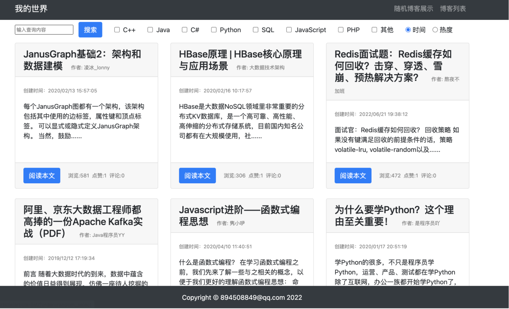
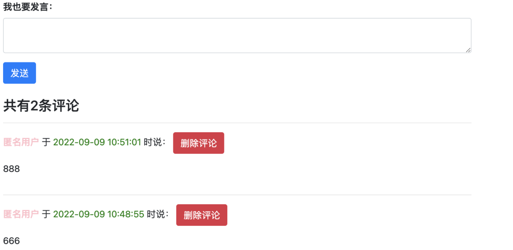
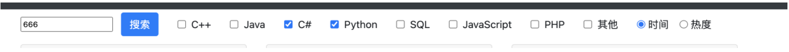
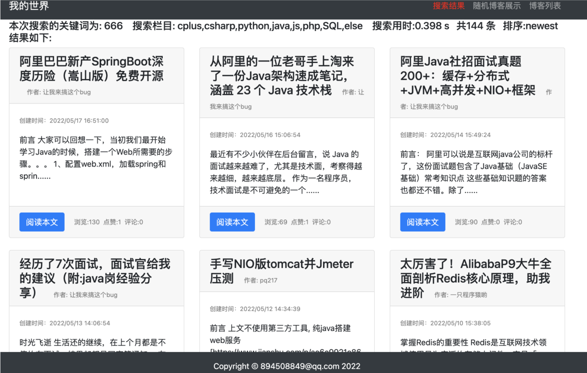
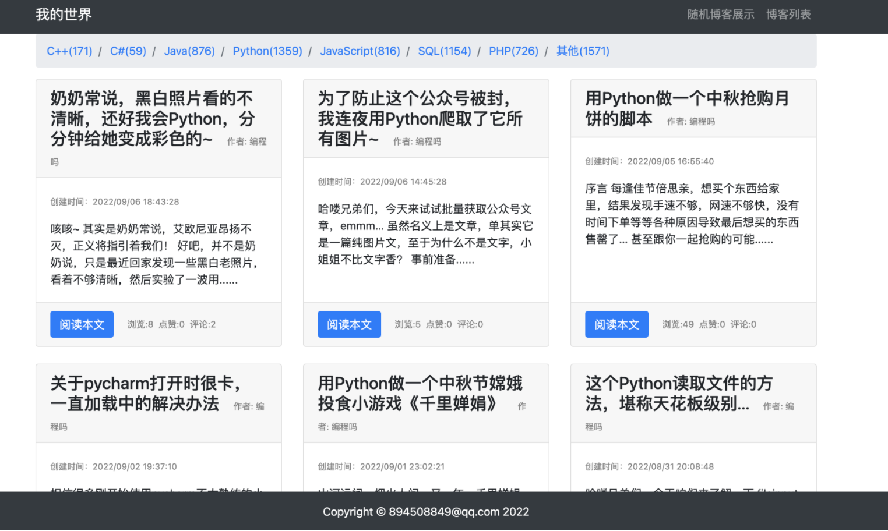
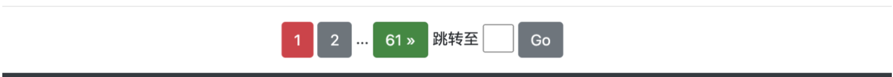

#### 项目文档

##### 1. 爬虫部分

​	  爬虫部分主要使用了beautifulsoup对requests.get获得到的html文件进行解析，使用find_all、子节点提取和正则表达式等对获得到的内容进行信息提取；对于数据的保存方面，对于爬取的第i篇文章，将其存在result/i文件夹下，通过正则表达式匹配获取其中图片的src，并进行进一步的爬取，将文章中的第j张图片保存在result/i/j.png中，同时对于文章正文，将其写入子文件夹下的body.html中，result.json中保存着该篇博客的全部信息，格式如下，方便后续的数据分析：

```json
{
   "version": "1.0",
   "results": {
      "create_time": "2019/12/10 12:38:41",
      "views": 1909,
      "body": "正文部分",
      "passage_url": "https://www.jianshu.com/p/c34d600f7156",
      "passage_title": "线性代数1-向量相加，向量乘以标量",
      "passage_abs": "向量的基本操作 向量的基本操作包括：向量相加，向量乘以标量。 标量标量（scalar）：一个标量就是一个单独的数，我们在使用标量时，一般都要明确...",
      "user_name": "赵阳_c149",
      "user_homepage": "https://www.jianshu.com/u/96287c50380a",
      "comments": 0,
      "likes": 1,
      "user_info": {
         "name": "赵阳_c149",
         "关注": 82,
         "粉丝": 71,
         "文章": 139,
         "字数": 82,
         "收获喜欢": 82,
         "总资产": 82
      },
      "tag": "else",
      "user_img": "/media/user_img/赵阳_c149.png"
   },
   "explain": {
      "used": true,
      "details": "this is for josn test"
   }
}
```

具体的爬虫项目代码在源文件中已经给出，在此处就不具体阐述了，数据方面共爬取了要求分类下的5200篇博客文章


##### 2. Web设计方面

###### 2.1首页

​		首页主要包含了以下功能：

- 展示随机的20篇博客
- 可以进行忽略大小写的内容搜索



使用了bootstrap中的card组件对页面进行美化，对于每一篇文章，展示一个card并摆放相关概要内容方便浏览，点击“阅读本文”按钮可以进入文章详细页面。

###### 2.2 文章详情页


在每篇文章的末尾设置了评论功能，评论按照时间顺序排列：



> 在具体的技术方面，共创建了article和comment两个model，彼此作为外键存放于django项目的db.sqlite中，在搜索的时候，通过获得cmt.objects.all获取全部comment对象，进一步通过文章id对评论对象进行过滤，最后将其传入article_detail模版进行显示即可

###### 2.3博客列表与分类

​		博客列表页主要是一个article_list的template，使用Django自带的分页功能进行分页，每一页共12篇文章，其中的order关键词代表其是否为**随机博客展示**（随机页面使用了同样的article_list的template），select代表**展示的分类**，key代表搜索的**关键词**，range代表搜索时选取的**搜索范围**，type代表**排序方式**，有newest和hottest两种，具体的分类、关键词的搜索，也是使用了**QuerySet的fliter函数与Q对象**结合，判断正文和标题是否含有搜索词即可，因为使用了数据库，这方面的工作较为轻松。下面是成果展示：

- 搜索框：（**搜索功能不需要考虑大小写**）

  

- 搜索结果页面：

  

- 分类列表页：

  

- 页码跳转：

  通过list页面传入需要的page页面，在views.py中获得关键词并返回对应页面内容即可（**输入页码进行特定页面的跳转用了一个简单的javascript脚本进行onclick跳转**）：

  

##### 3. 数据分析：

​	详情请看数据分析文档

##### 4. 技术汇总：

- 爬虫相关：

  Beautifulsoup4

  1. 通过基础链接如`url = 'https://www.jianshu.com/c/86ff829f995f?order_by=added_at&page={i}'.format(i = i)`，通过for循环生成数个用户搜索结果页，获取每一篇博客文章后进行详细爬取即可；
  2. 对于每个`url`，利用伪装`User-Agent`的`headers`，用`requests.get`函数获取该网址的静态html内容，每次请求间隔1秒；
  3. 用`BeautifulSoup`处理获取的html内容，再用`find_all`/`find`函数来找到所有含有某参数信息/第一个含某参数信息的内容，获得用户ID相关信息

- 网站搭建：
  1. Django框架：用Django模型层存储视频及用户的数据，创建article和comment两个model进行详细的信息存储与展示，views.py配置url并简单实现response和request的前后端交流，表单来快速使用get和post指令并在html文件中使用py文件中传来的数据。
  2. CSS、JS美化：通过标签、class、id等信息，使用bootstrap美化视图；通过Javascript代码（本项目没有单独的js文件，而是将代码以<script></script>的形式内嵌在html文件中）实现函数跳转等
  3. 数据库操作：使用Django项目创建时的db.sqlite进行数据的存储与关键词的搜索

- 数据分析：
  1. Numpy数组运算：将`list`转化为`numpy.array`格式，实现更快速的数组运算。
  2. Matplotlib绘图：用`matplotlib.pyplot.scatter`函数实现散点图，`matplotlib.pyplot.bar`函数实现柱状图等，方便数据的可视化，使其更直观。

​	

